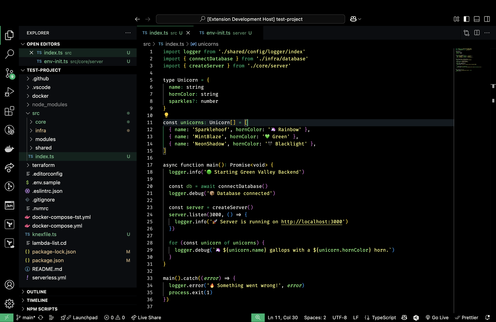
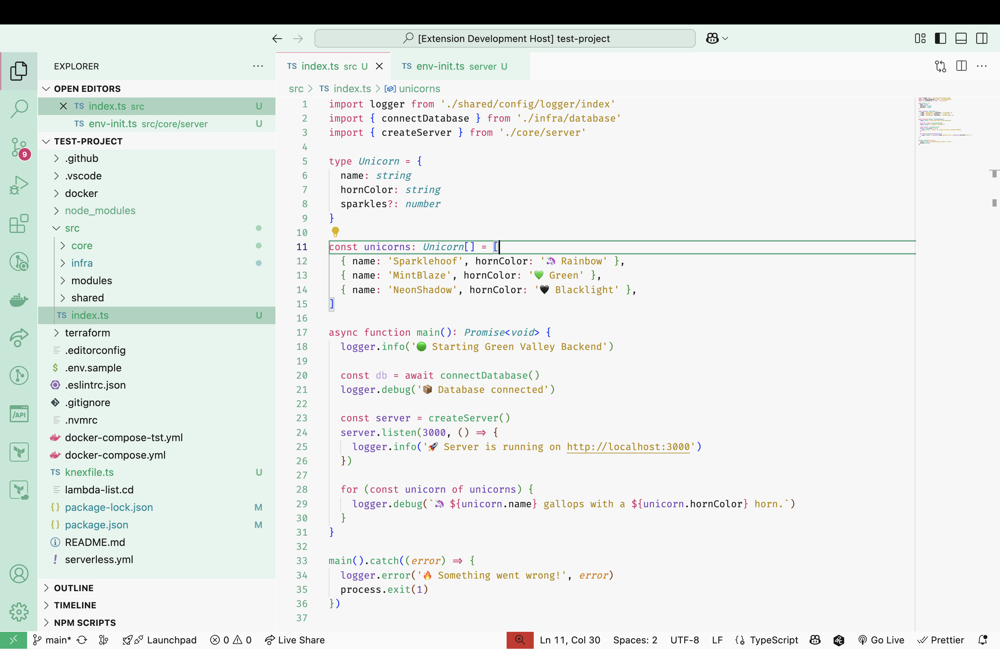
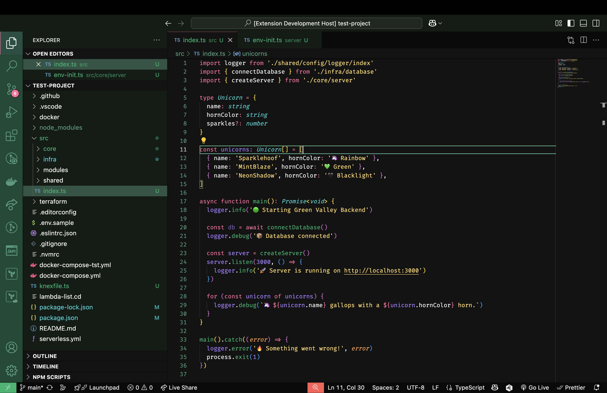
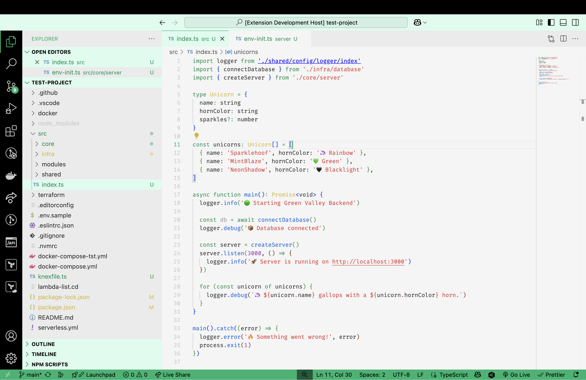
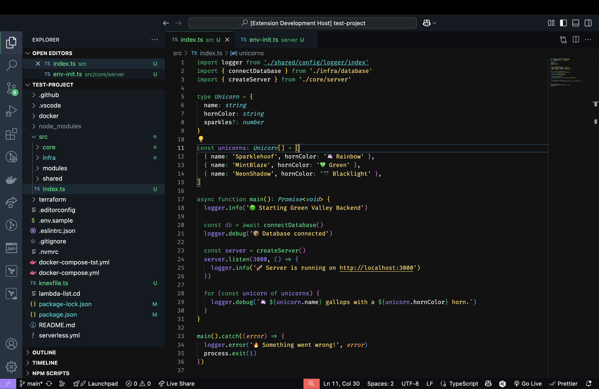
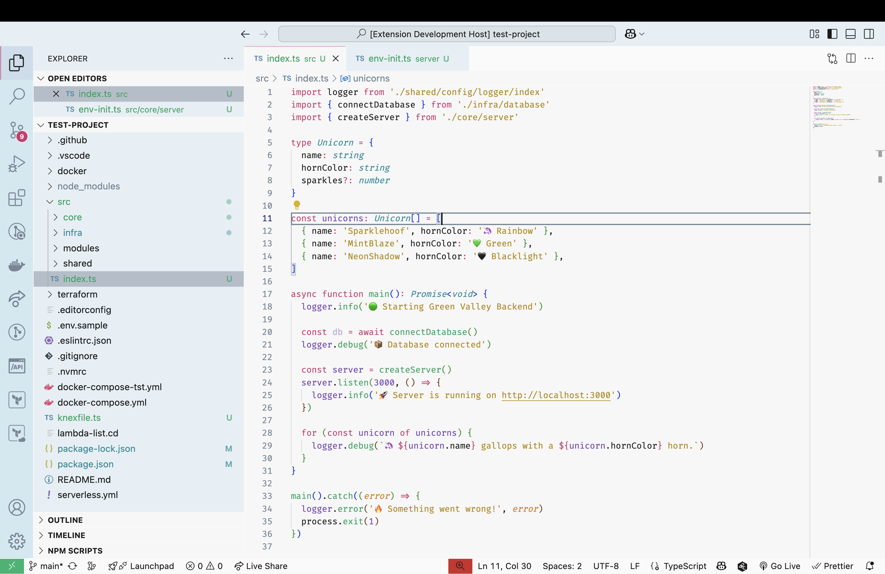
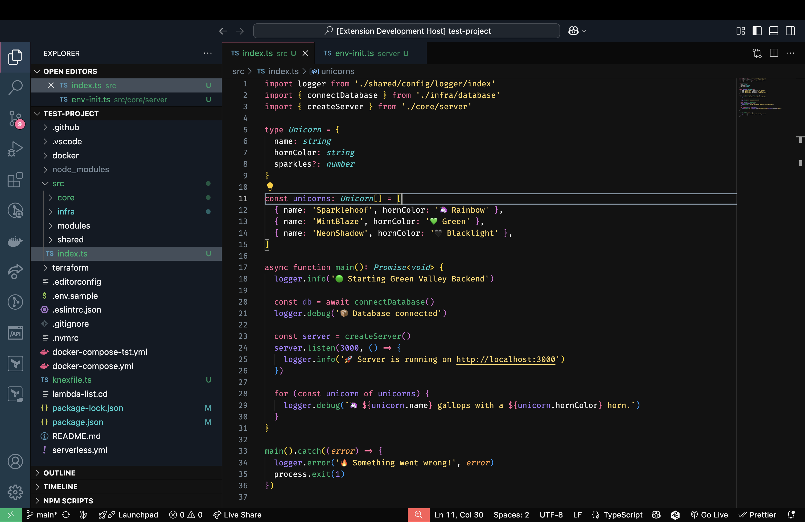

<!--  -->

#  Green Valley Theme

A fresh, vibrant, and modern green-themed color palette for your favorite code editor, crafted with care by **Helcio Penha**. Perfect for long coding sessions, it's designed to be easy on the eyes and give your workspace a relaxing, yet energized vibe!

  
  
  

## 🎨 What's Inside?

Explore a variety of flavors tailored to your style:

### 🌙 Dark Modes

- **Midnight** – Deep, rich blacks combined with bright greens; ideal for night owls.
- **Forest** – Natural, soothing dark greens that immerse you in coding tranquility.
- **Matrix** – Bold, futuristic greens to make you feel like Neo hacking the mainframe.
- **Neo** – Sleek, clean lines with balanced contrasts for that modern developer look.

### ☀️ Light Modes

- **Mint** – Refreshingly cool and crisp, great for daytime productivity.
- **Breeze** – Light, airy greens that keep your workspace feeling fresh.
- **Zen** – Soft pastel greens to keep your coding sessions calm and balanced.

## 📸 Screenshots

Take a peek at how each variant transforms your coding environment.  
Feel free to share your own setup and submit a pull request!

| Dark Variants            | Screenshot                                     |     | Light Variants         | Screenshot                                    |
| ------------------------ | ---------------------------------------------- | --- | ---------------------- | --------------------------------------------- |
| 🌙 Green Valley Midnight |  |     | 🌿 Green Valley Mint   |    |
| 🌲 Green Valley Forest   |    |     | 💨 Green Valley Breeze |  |
| 💻 Green Valley Matrix   |    |     | 🧘 Green Valley Zen    |     |
| ✨ Green Valley Neo      |       |     | –                      | –                                             |

## 📥 How to Install

Ready to go green? Just follow these steps:

1. Open VS Code.
2. Click the Extensions icon (`Ctrl+Shift+X`).
3. Search for **"Green Valley Theme"** and hit **Install**.
4. Activate your favorite variant via **File → Preferences → Color Theme**.

🌟 **Enjoy your new green-powered coding setup!** 🌟

## ✨ Font Recommendations

Enhance your experience by pairing your Green Valley Theme with these fantastic coding fonts:

- [JetBrains Mono](https://www.jetbrains.com/lp/mono/) – Clean and highly readable, perfect for intense coding.
- [Fira Code](https://github.com/tonsky/FiraCode) – Great ligatures and style for developers who like that extra flair.
- [Cascadia Code](https://github.com/microsoft/cascadia-code) – Microsoft's modern, versatile, and elegant typeface.

## 👨🏻‍💻 Meet the Creator

Made with 💚 by **Helcio Penha**. Feel free to connect!

📧 [me@helciopenha.com](mailto:me@helciopenha.com)

## 📄 License

Distributed under the [MIT](LICENSE) License © Helcio Penha
